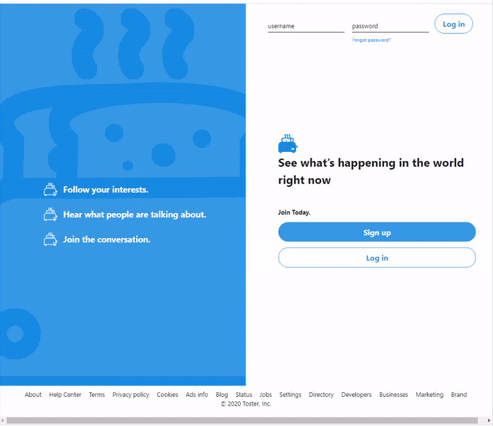
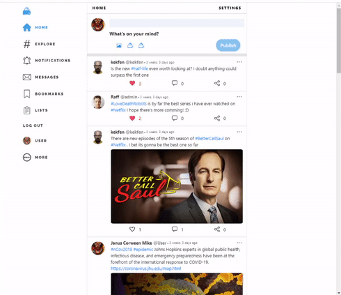
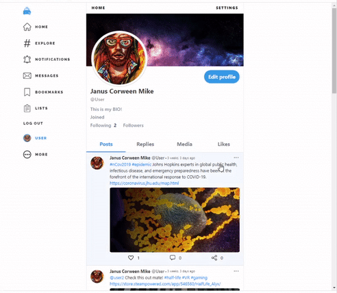

Toster is a copy of Twitter implemented in *Django framework*.    
Those are its main features:
---

  * #### User authenthication and creating new posts   

  * #### Commenting and liking posts

  * #### Editing profile

  * #### Viewing profile content and browsing hashtags

